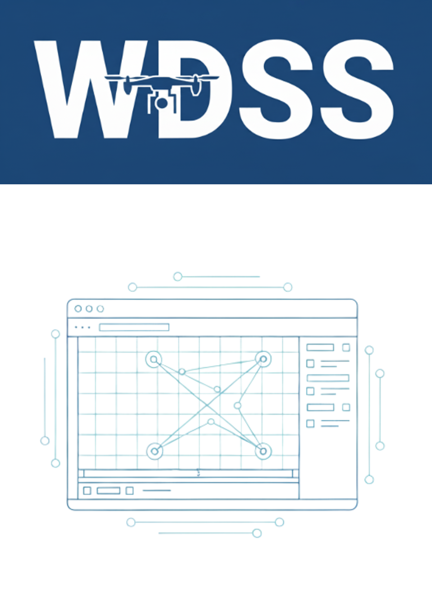
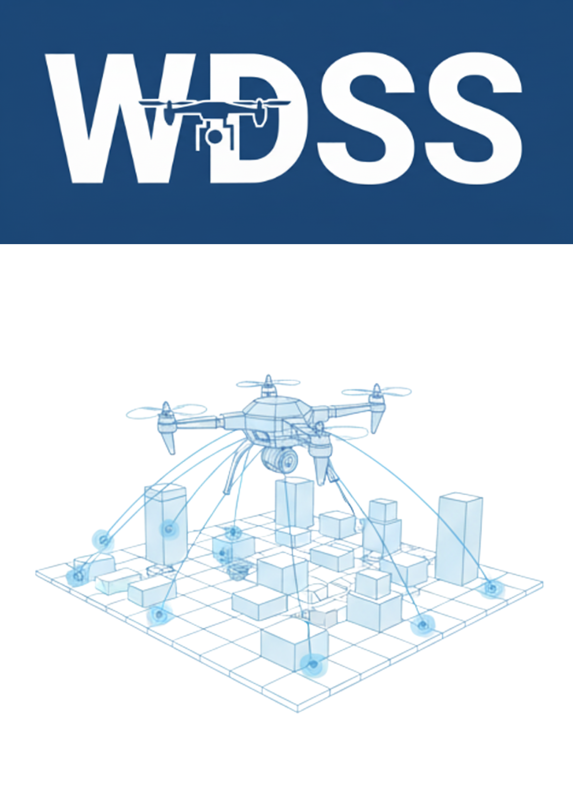
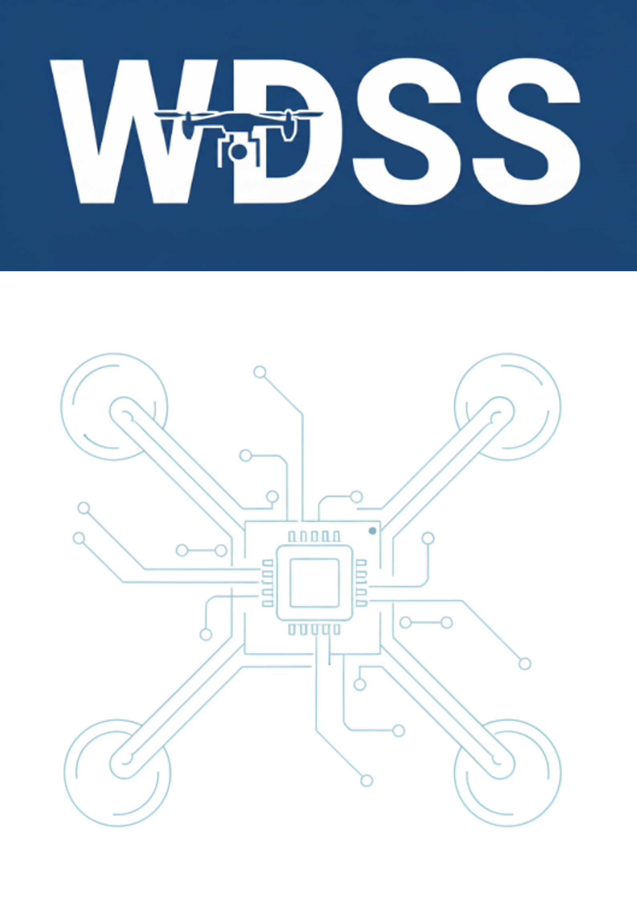
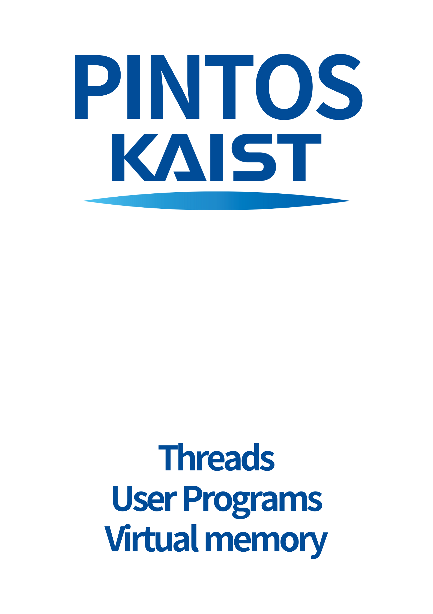
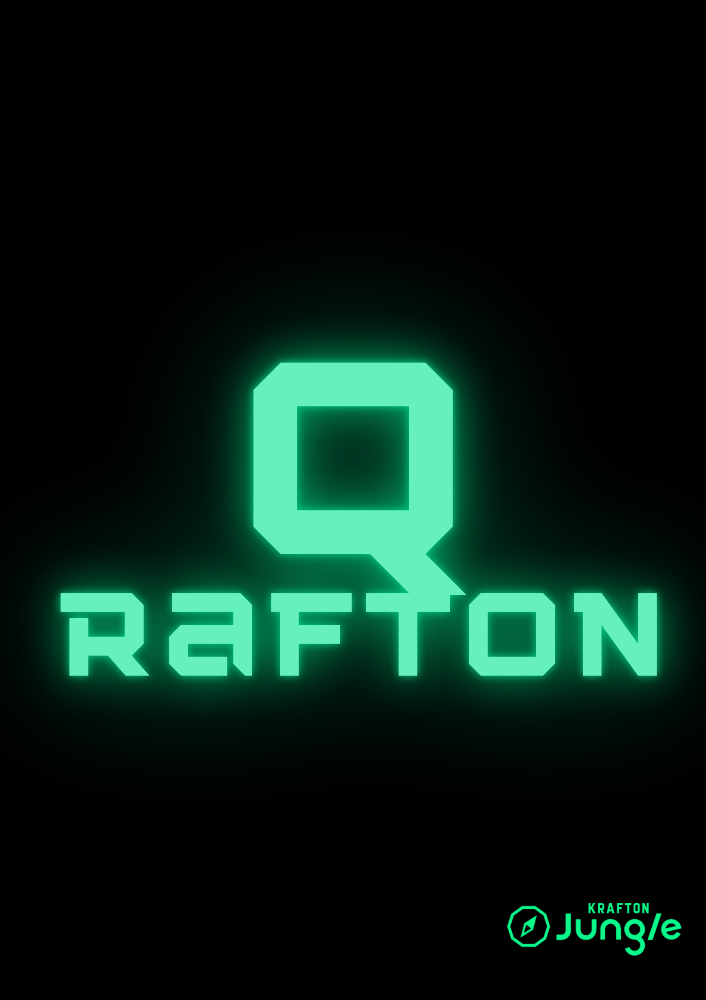
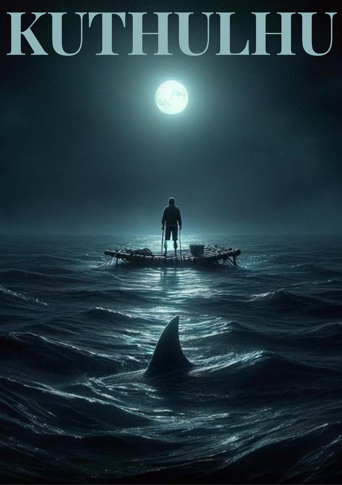
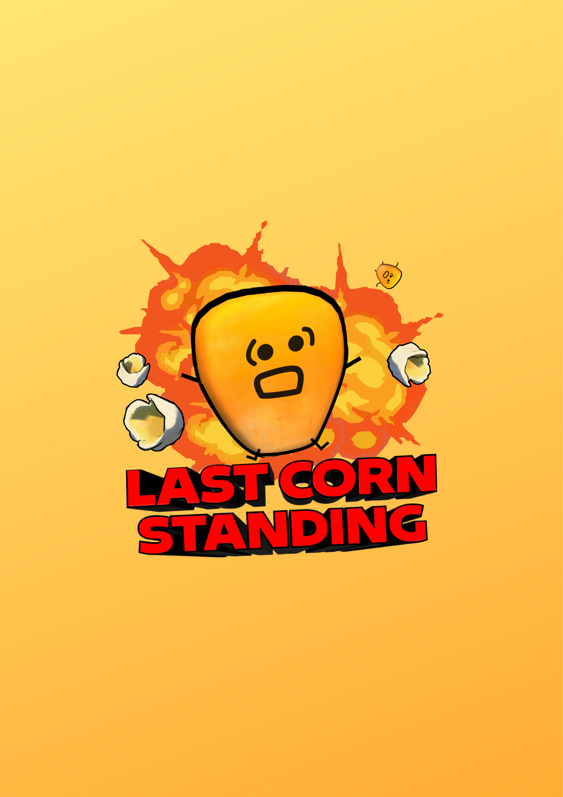

<h1 align="center">Taeyun Lee — Project Collection</h1>

<em>Click on any image to visit its repository.</em>

<table width="100%" cellpadding="0" cellspacing="0" style="border-collapse:collapse; table-layout:fixed;">
  <tr>
    <td width="25%"></td>
    <td width="25%"></td>
    <td width="25%"></td>
    <td width="25%"></td>
  </tr>
  <tr>
    <td align="center"><a href="https://github.com/MW-1st/WDSS-web"><strong>[WDSS-Web]</strong></a></td>
    <td align="center"><a href="https://github.com/MW-1st/WDSS-Unity-GCS"><strong>[WDSS-Unity-GCS]</strong></a></td>
    <td align="center"><a href="https://github.com/plan6062/WDSS-ESP-Drone"><strong>[WDSS-ESP32-Drone]</strong></a></td>
    <td align="center"><a href="https://github.com/plan6062/JJangtos"><strong>[PintOS(x86-64)]</strong></a></td>
  </tr>

  <tr>
    <td width="25%"></td>
    <td width="25%"></td>
    <td width="25%"></td>
    <td width="25%"></td>
  </tr>
  <tr>
    <td align="center"><a href="https://github.com/plan6062/qrafton"><strong>[Qrafton]</strong></a></td>
    <td align="center"><a href="https://github.com/plan6062/KUthulhu"><strong>[Kuthulhu]</strong></a></td>
    <td align="center"><a href="https://github.com/plan6062/LastCornStanding"><strong>[LastCornStanding]</strong></a></td>
    <td align="center"><a href="https://github.com/redcarrot1/Volunteer-KU"><strong>[VolunteerKU]</strong></a></td>
  </tr>
</table>

---

### **🚀 Interested in**
- Full-Stack Application
- Computer Science
- Embedded System
- Game Development

 

### 🛠️ Technologies Used in My Projects

#### 🚀 Front-End

  
  
  
  
  

#### ⚙️ Back-End

  
  
  
  
  

#### 💾 Database

#### 🤖 IoT & Embedded Systems

  
  

#### 🎮 Game Development

  
  

#### 📱 Mobile Development

  

 

### **📊 Most Used Languages**

  

 

## **📬 About me**

  &nbsp;
  &nbsp;
  &nbsp;

---
